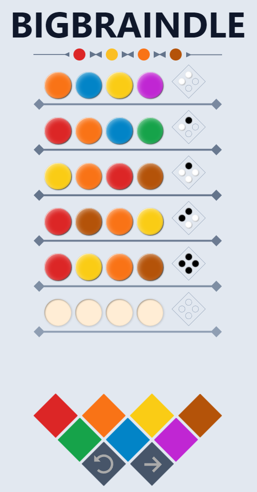

# Bigbraindle

Bigbraindle is a color guessing game where the player has to guess a sequence of four out of seven possible colors. After each guess the player is given a set of hints. A black dot means there is one color in the correct place and a white dot means there is a correct color but not in the correct spot of the sequence. The player has to identify which hint corresponds to which guessed color. No repeats or empty spots are possible. 

    

---

The project was build from scratch with the following tech stack:
- [Typescript](https://www.typescriptlang.org/)
- [Next.js](https://nextjs.org/)
- [TailwindCSS](https://tailwindcss.com/)

It is deployed via [Vercel](https://vercel.com/) on [bigbraindle.mojansen.com](https://bigbraindle.mojansen.com).